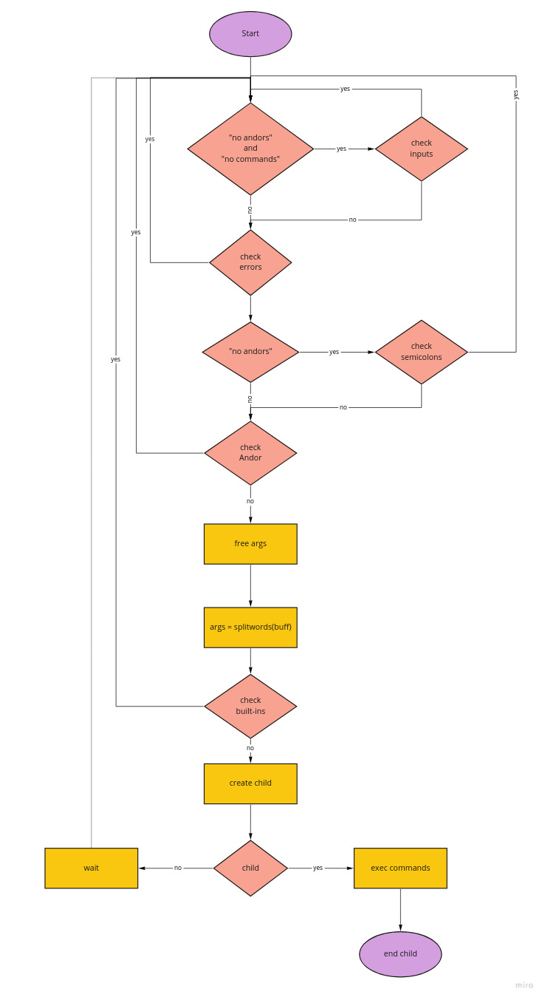

# simple_shell

simple_shell is simple version of the linux shell. It's the final project for Holberton's first trimester

## Authors

- Santiago Cano
- Sebastian Caicedo

## Flow Chart

              

## How to compile
To compile the project, just run 'gcc *.c -o shell'
(This project was created and run in ubuntu 14.04.)

## How to use

# Interactive mode

Run './shell', then write the commands to execute and press enter
To exit the shell enter 'exit' command.

# Non-interactive mode

Redirect stdin to shell using pipelines '|', or also redirect from a file using '<' symbol

examples:
- 'echo "ls" | ./shell'
- './shell.c < input_file'

